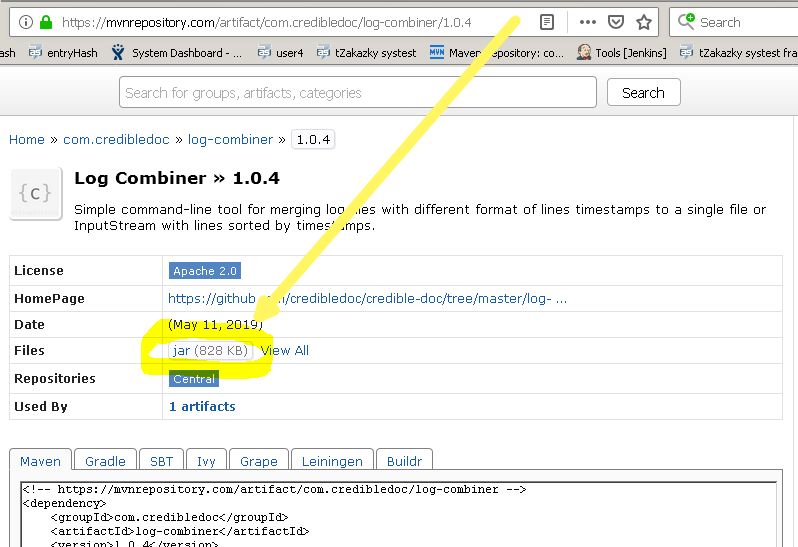

# Module log-combiner
This module creates a simple command-line tool for merging log files
with different format of lines timestamps to a single file or readable source
with lines sorted by timestamps.

## Download
This tool can be [downloaded from this page](https://mvnrepository.com/artifact/com.credibledoc/log-combiner),
see the image

1. Select the newest version

2. Select a link next to the 'Files' word in the page, see the image

## Usage
    java -jar &&beginPlaceholder {
                                 "className": "com.credibledoc.substitution.content.generator.pom.JarNameContentGenerator",
                                 "description": "Latest log-combiner jar file name",
                                 "parameters": {
                                     "url": "https://repo1.maven.org/maven2/com/credibledoc/log-combiner/maven-metadata.xml",
                                     "nameAndVersionSeparator": "-"
                                 }
                             } &&endPlaceholder.jar <folderAbsolutePath> [configAbsolutePath]

## Examples
Combine all files in the `/var/log/temp` folder recursively.

    java -jar &&beginPlaceholder {
                                 "className": "com.credibledoc.substitution.content.generator.pom.JarNameContentGenerator",
                                 "description": "Latest log-combiner jar file name",
                                 "parameters": {
                                     "url": "https://repo1.maven.org/maven2/com/credibledoc/log-combiner/maven-metadata.xml",
                                     "nameAndVersionSeparator": "-"
                                 }
                             } &&endPlaceholder.jar /var/log/temp
                             
In case of existing `log-combiner.properties` configuration file log files will be
merged with configuration parameters. Else default configuration parameters
will be used and files will be joined by last modification time.

    java -jar &&beginPlaceholder {
                   "className": "com.credibledoc.substitution.content.generator.pom.JarNameContentGenerator",
                   "description": "Latest log-combiner jar file name",
                   "parameters": {
                       "url": "https://repo1.maven.org/maven2/com/credibledoc/log-combiner/maven-metadata.xml",
                       "nameAndVersionSeparator": "-"
                   }
               } &&endPlaceholder.jar /var/log/temp /var/log/combiner/two-apps.properties
In this case log files from the `/var/log/temp` folder will be merged. And the
`/var/log/combiner/two-apps.properties` configuration file will be used. In this case you should create
the `two-apps.properties` file in the `/var/log/combiner/` folder.

## Arguments description
* `&&beginPlaceholder {
                      "className": "com.credibledoc.substitution.content.generator.pom.JarNameContentGenerator",
                      "description": "Latest log-combiner jar file name",
                      "parameters": {
                          "url": "https://repo1.maven.org/maven2/com/credibledoc/log-combiner/maven-metadata.xml",
                          "nameAndVersionSeparator": "-"
                      }
                  } &&endPlaceholder.jar` (mandatory) is an executable jar file. Latest release is located on the Maven Central Repository.
It can be [downloaded from this page](https://mvnrepository.com/artifact/com.credibledoc/log-combiner),
see a link next to the 'Files' in the page, see images above.
* `folderAbsolutePath` (mandatory) is a path to a folder with log files for merging.
Files will be parsed in this folder and sub-folders recursively.
* `configAbsolutePath` (optional) is a configuration file path. Example of the file see below. If the `configAbsolutePath`
is not defined in command line, default value is `log-combiner.properties` located
in the same folder, next to the &&beginPlaceholder {
             "className": "com.credibledoc.substitution.content.generator.pom.JarNameContentGenerator",
             "description": "Latest log-combiner jar file name",
             "parameters": {
                 "url": "https://repo1.maven.org/maven2/com/credibledoc/log-combiner/maven-metadata.xml",
                 "nameAndVersionSeparator": "-"
             }
         } &&endPlaceholder.jar file.
If the configuration file not found then all files will be merged by last modification time.

## Configuration file log-combiner.properties

This example of `log-combiner.properties` file contains configuration of two
different formats of log files - `app0` and `app1`.

    # File log-combiner.properties
    
    insertLineSeparatorBetweenFiles = false
    
    printNodeName = true
    
    # Example of timestamp: 22.04.2019 07:59:27.910
    regex[0] = \\d\\d\\.\\d\\d\\.\\d\\d\\d\\d\\s\\d\\d:\\d\\d:\\d\\d\\.\\d\\d\\d
    maxIndexEndOfTime[0] = 24
    simpleDateFormat[0] = dd.MM.yyyy HH:mm:ss.SSS
    applicationName[0] = app0
    
    # Example of timestamp: 2019-04-22T07:59:27.920+0100
    regex[1] = \\d\\d\\d\\d-\\d\\d-\\d\\dT\\d\\d:\\d\\d:\\d\\d\\.\\d\\d\\d[+-]\\d\\d\\d\\d
    maxIndexEndOfTime[1] = 40
    simpleDateFormat[1] = yyyy-MM-dd'T'HH:mm:ss.SSSZ
    applicationName[1] = app1
    
    #regex[2] = ...
    #maxIndexEndOfTime[2] = ...
    #simpleDateFormat[2] = ...
    #applicationName[2] = ...

### Parameters description
* `insertLineSeparatorBetweenFiles` (optional, default false, allowed value `true`) if defined as `true`,
System.lineSeparator() will be inserted after each file except the last one
* `printNodeName` (optional, default true, allowed value `false`) if defined as `true`, log lines from sub-folders will be prefixed
by sub-folder name. It is useful in case when the same application is installed on multiple nodes and each node generates
its own logs. In this case each node files should be places in sub-folders. See example below.
* `regex` (mandatory) the pattern of datetime searching in a log line
* `maxIndexEndOfTime` (optional) if defined, the first part of a line will be searched by matcher for datetime pattern.
If not set, the whole line will be searched by matcher. For example if the whole line is 100 characters length,
and `maxIndexEndOfTime` is set to `20`, the datetime will be searched
in a substring from `0` to `20` characters of the line `exclusive`.
* `simpleDateFormat` (mandatory) a pattern for parsing datetime string to a `java.util.Date` object
* `applicationName` (optional) if defined, each line in a merged file will be prefixed by this value.
It is useful for better readability of merged files, where logs from different applications and nodes
combined into a single file. In this case each line can be distinguished which application it belongs to.
For example:

     node1 app1 INFO 2019-04-22T07:59:27.000+0200 [main] Application app1 started.
     
     node0 app0 22.04.2019 07:59:27.910 [main] INFO Application app0 started.
     
     node1 app0 22.04.2019 07:59:27.910 [thread2] INFO Application app0 started.

Example of folder structure with log files from multiple nodes (`node0` and `node1`)
and multiple applications (`app0` and `app1`) :

    folder
        node0
            app0.log
        node1
            app0.log
            app1.log
        
[This page](doc/usage/programmatically.md) describes how to use this library programmatically.
